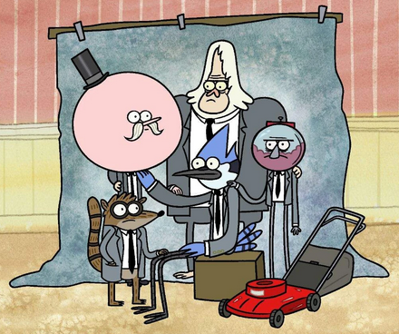

# Clasificación

## 🎮 Videojuegos

¡Aquí te dejo algunos de mis videojuegos favoritos! Mis favoritos son:

| Videojuego           | Desarrollador           | Género              |
|----------------------|-------------------------|---------------------|
| **Gears of War**     | Epic Games              | Acción              |
| **The Witcher 3**    | CD Projekt Red          | Aventura            |
| **Overwatch**        | Blizzard Entertainment  | Multijugador        |
| **Minecraft**        | Mojang                  | Aventura            |

---

## 📺 Caricaturas

Me encanta disfrutar de **caricaturas y shows animados**. Ma favoritas son:

| Caricatura           | Estudio                | Género              |
|----------------------|------------------------|---------------------|
| **Un Show Más**      | Cartoon Network        | Comedia             |
| **Rick and Morty**   | Adult Swim             | Ciencia ficción     |
| **Avatar: La Leyenda de Aang** | Nickelodeon  | Aventura            |
| **The Simpsons**     | Fox                    | Comedia             |
| **Adventure Time**   | Cartoon Network        | Aventura            |

---
# Clasificación
| Título                             | Autor                          | Género               |
|------------------------------------|--------------------------------|----------------------|
| *Pardaillan*                       | Miguel de Zévaco               | Novela histórica     |
| *Cien años de soledad*             | Gabriel García Márquez         | Realismo mágico      |
| Película                          | Director                      | Género               |
|------------------------------------|--------------------------------|----------------------|
| *Inception*                        | Christopher Nolan              | Ciencia ficción      |
| *The Matrix*                       | The Wachowskis                 | Ciencia ficción      |
| Artista                          | Álbum                          | Género               |
|------------------------------------|--------------------------------|----------------------|
| *Daft Punk*                        | *Random Access Memories*       | Electrónica          |
| *The Beatles*                      | *Abbey Road*                   | Rock                 |
| Videojuego                       | Desarrollador                 | Género               |
|------------------------------------|--------------------------------|----------------------|
| *Gears of War*                     | Epic Games                    | Shooter, Acción      |
| *The Witcher 3*                    | CD Projekt Red                | RPG, Aventura        |
