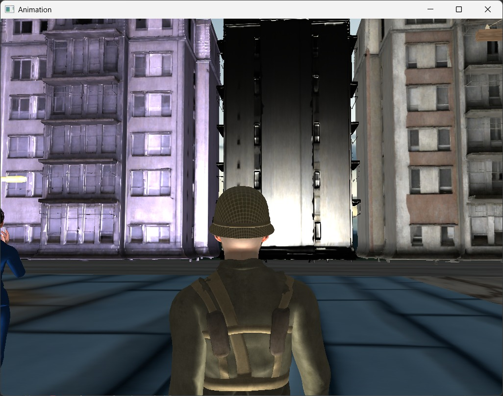
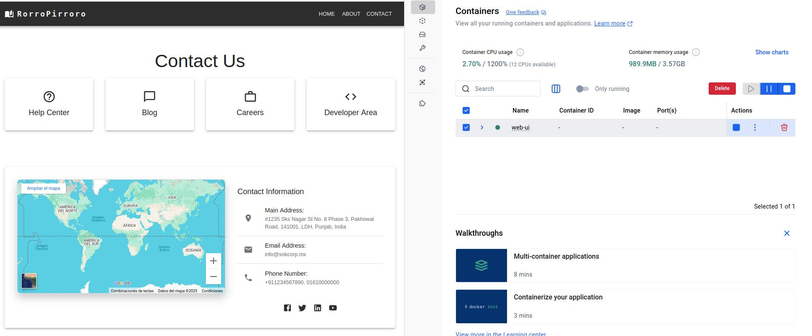

# Proyectos

## 🌟 Proyecto 1: OpenGL - Escena Animada

Estoy trabajando en un proyecto de **OpenGL** para crear una escena animada, en la cual estoy implementando diversas técnicas gráficas y programación de animaciones. El proyecto involucra:

### **Detalles del Proyecto**:
- **Cámara 3D**: Manejo de perspectiva y cámara dinámica para una visualización fluida de la escena.
- **Shaders**: Utilizo **Phong** para iluminación y **Fresnel** para efectos de reflexión, con un enfoque especial en **shaders procedurales** para generar texturas y efectos en tiempo real.
- **Modelado 3D**: Los objetos son creados en **Blender** y luego exportados a OpenGL, con la ayuda de archivos **JSON** para gestionar las animaciones de los modelos.
- **Animaciones**: Manipulación de datos exportados en formato **JSON** para la animación de los objetos de la escena en función de sus transformaciones.

### **Imagen del Proyecto:**

---

## 🌐 Proyecto 2: Aplicación Web con React y Docker

Mi segundo proyecto consiste en desarrollar una **aplicación web** utilizando **React** para la interfaz de usuario y **Docker** para la contenedorización de la aplicación. La idea es crear una plataforma interactiva que sea completamente escalable y fácil de desplegar. 

### **Detalles del Proyecto**:
- **Frontend con React**: Desarrollo de una interfaz de usuario interactiva y dinámica utilizando **React**. Implementación de funcionalidades modernas con **React Hooks** y **Context API** para manejar el estado.
- **Docker**: Toda la aplicación será contenedorizada con **Docker**, facilitando su despliegue y asegurando la consistencia del entorno de desarrollo y producción.
- **Documentación en Git**: Todo el proceso de desarrollo será documentado en **Git** utilizando una estructura de ramas clara y asegurando buenas prácticas de control de versiones.
- **Despliegue y mantenimiento**: Implementación de un flujo de trabajo para el **despliegue continuo** y mantenimiento de la aplicación.

### **Imagen del Proyecto:**

---

### 🔧 **Próximos Pasos**:
1. Mejorar la animación en OpenGL.
2. Implementar nuevas funcionalidades y optimizar el rendimiento de la aplicación React.
3. Documentar y actualizar continuamente ambas plataformas en Git para asegurar la trazabilidad del proyecto.

# Mis Proyectos
:)
:)
:)
:)
:)
